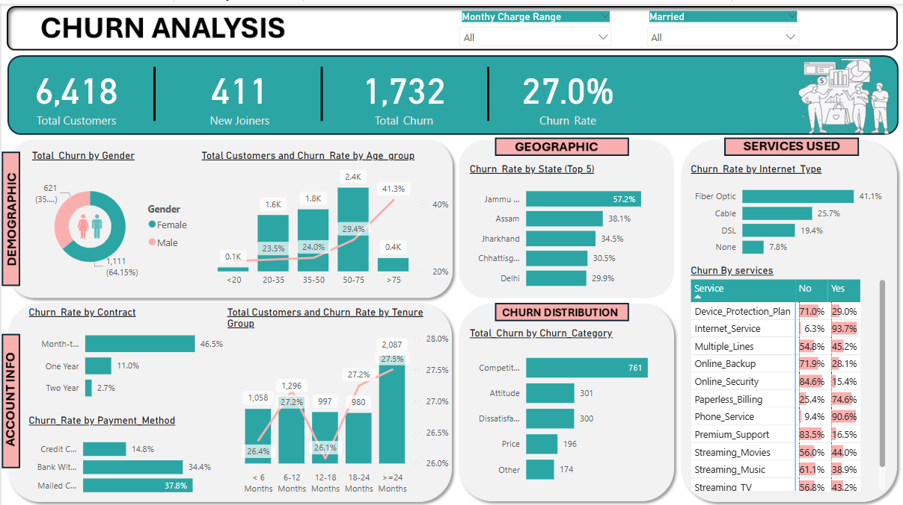

# Churn Analysis Dashboard

This repository showcases a Power BI dashboard analyzing customer churn across various dimensions such as age, gender, tenure, and service usage. The goal is to identify churn trends and support data-driven decision-making for improving customer retention strategies.

## 📊 Key Features
- Dynamic analysis by age group and tenure  
- Gender-based churn distribution  
- Percentage comparison of churn vs total customers  
- Highlighted divergence patterns in churn rate vs customer base  

## 🛠 Tools & Technologies Used
- **Power BI Desktop** – for dashboard creation and interactive visualizations  
- **SQL & SQL Server** – to query, clean, and join relational tables for model input  
- **Power Query** – for data wrangling, transformation, and loading  
- **DAX (Data Analysis Expressions)** – for creating custom measures and KPIs  
- **Combo Charts, Donut Charts, and Slicers** – for visual storytelling  

## 📌 Summary
This dashboard helps uncover key churn drivers by analyzing patterns across customer demographics and behavior. By highlighting the segments with the highest churn and visualizing comparative metrics, it supports strategic planning and targeted customer retention initiatives.
